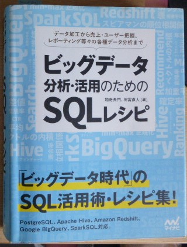
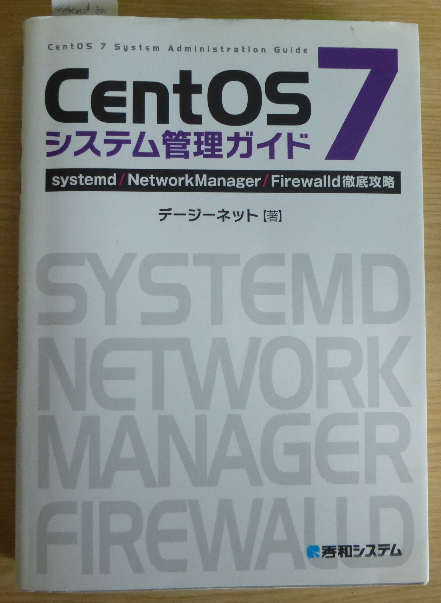

# ubuntu_server_tools

自宅サーバー(Ubuntu Server 24.04)のセキュリティを管理する運用ツール集

自宅サーバーを運用していると日々不特定多数のクライアントから不正アクセスを頻繁に受けています。

対策としては継続的(3〜4日以上)かつ1日あたりの不正アクセス回数(30回以上)の多いクライアントIPをバケットフィルタリングの対象にしています。

### ソースコードのディレクトリ構成

```
└── src
    ├── development_pc      # A) クライアントPCで実行するスクリプト類
    │   ├── data            #  1. SQLスクリプト
    │   │   └── sql        #
    │   ├── docker          #  2. PostgreSQL16サーバー用 docker コンテナ生成ソース 
    │   └── python          #  3. pythonスクリプト
    │       └── ServerTools #    3-1. サーバーで収集したログをもとにデータベース一括登録
    └── server_pc            # B) サーバー側で実行するスクリプト類
        ├── logs             #  1. サンプルログファイル
        └── scripts          #  2. シェルスクリプト
            ├── bin          #  
            └── var         
                └── spool
                    └── cron
                        └── crontabs
```

## 実行環境

+ サーバーPC
  + Ubuntu Server 24.04

+ 開発PC
  + Ubuntu Desktop 22.04


## データベース

不正アクセスのIPアドレスとアクセス回数を管理するデータベースとして **PostgreSQL 16** を dockerコンテナ内で稼働させています。


## 不正アクセスのログ収集

journalctlログ(対象: ssh.service) から取得された不正アクセスされたログの一例

```bash
2024-06-12T20:57:27+09:00 examplehost sshd[102632]: pam_unix(sshd:auth): authentication failure; logname= uid=0 euid=0 tty=ssh ruser= rhost=103.77.241.34  user=root
2024-06-12T20:57:30+09:00 examplehost sshd[102632]: Failed password for root from 103.77.241.34 port 57052 ssh2
2024-06-12T20:57:36+09:00 examplehost sshd[102632]: Connection closed by authenticating user root 103.77.241.34 port 57052 [preauth]
2024-06-12T20:57:55+09:00 examplehost sshd[102634]: pam_unix(sshd:auth): authentication failure; logname= uid=0 euid=0 tty=ssh ruser= rhost=103.77.241.34  user=root
2024-06-12T20:57:58+09:00 examplehost sshd[102634]: Failed password for root from 103.77.241.34 port 36960 ssh2
2024-06-12T20:58:04+09:00 examplehost sshd[102634]: Connection closed by authenticating user root 103.77.241.34 port 36960 [preauth]
```

さらにpythonスクリプトで集計処理しやすくなるよう下記のようにログを限定します

```bash
2024-06-12T20:57:55+09:00 localhost.webriverside sshd[102634]: pam_unix(sshd:auth): authentication failure; logname= uid=0 euid=0 tty=ssh ruser= rhost=103.77.241.34  user=root
2024-06-12T20:58:21+09:00 localhost.webriverside sshd[102636]: pam_unix(sshd:auth): authentication failure; logname= uid=0 euid=0 tty=ssh ruser= rhost=103.77.241.34  user=root
```

+ 上記のログを出力するスクリプト  
**```src/server_pc/scripts/bin/ssh_auth_error_log.sh```**

+ 毎日翌日の0時10分に上記スクリプトを実行するcron  
**```src/server_pc/scripts/var/spool/cron/crontabs/cronuser```**


### 参考URL

PostgreSQL 16 に関しては下記日本語サイトを参考にしています。

+ PostgreSQL PostgreSQL 16.0文書
    + [第43章 PL/pgSQL — SQL手続き言語](https://www.postgresql.jp/document/16/html/plpgsql.html)
    + [SQLコマンド CREATE FUNCTION](https://www.postgresql.jp/document/16/html/sql-createfunction.html)
    + [第43章 PL/pgSQL — SQL手続き言語 43.10. トリガ関数](https://www.postgresql.jp/document/16/html/sql-createfunction.html)


Dockerに関してはコンテナ作成が容易なので Compose を使っています。
+ 公式ドキュメント
    + [Manuals / Docker Compose / install / Install the Compose plugin](https://docs.docker.com/compose/install/linux/)
    + [Postgresドッカーの公式イメージの使用方法](https://www.docker.com/ja-jp/blog/how-to-use-the-postgres-docker-official-image/#Start-a-Postgres-instance)  
    ※自動的に日本語に翻訳された公式ドキュメントのようですが、日本語訳が微妙です。
    + [postgres Docker Official Image
](https://hub.docker.com/_/postgres)  
※オフィシャルイメージ。どのバージョンを使うかはこのサイトを見ないとわかりません。

### 参考書

```
「ビックデータ分析・活用のためのＳＱＬレシピ」
  Chapter 3 | データ加工のためのSQL  
     3-2-6 IPアドレスを扱う
```

<div>

</div>
<br/>

10年以上前の発行ながらいまでも PostgreSQL のバイブル。

<div>

</div>
<br/>

発行から10年くらい過っていますが今でも役に立っています。  
※ 最近のUbuntu なら Firewalldをインストールすることで ufw を使わないパケットフィルタリングが可能 

```
Chapter1 systemd
   1.6 ジャーナルの制御 (journalctl)

Chapter3 Firewalld
   3.2 firewall-cmd によるパケットフィルタリング
   3.4 フィルタリングルールの設定
```

<div>

</div>
<br/>
